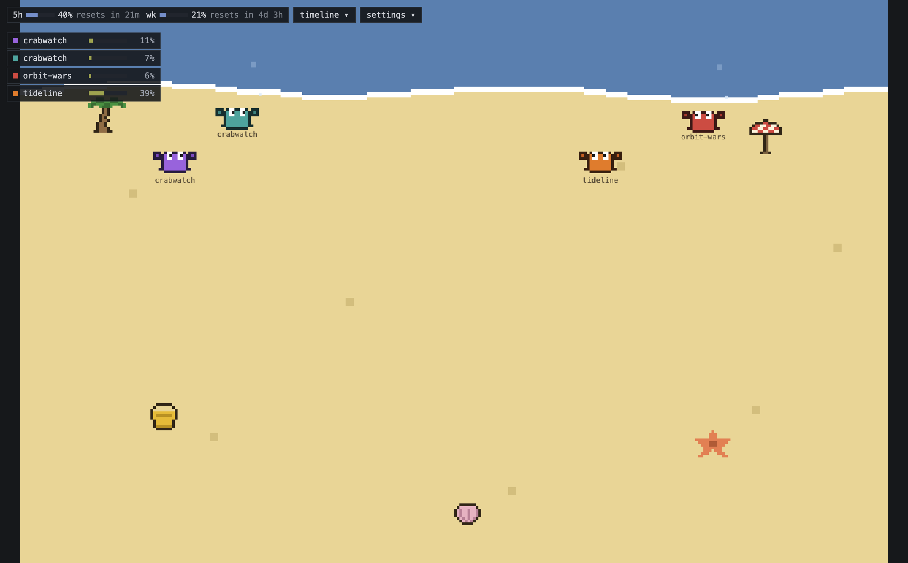

# CrabWatch 🦀

A macOS tray app that renders every local Claude Code session as a pixel
crab on a beach — and turns your session history into a per-project audit
timeline.



Built because I never clear sessions: one project is a chain of sessions,
handed off whenever context fills up. CrabWatch makes that history legible
at a glance.

## What it does

- **Live beach** — every Claude Code session on the machine is a crab:
  typing, thinking, waiting for input, sleeping, error daze, compact
  sweep, subagent juggling. All sprites are original and programmatically
  generated (`npm run gen-sprites`).
- **Audit timeline** — sessions grouped into tasks per project. Each
  segment is a real user turn, deterministically extracted from the
  transcript (files touched, commands, commits, subagents, tokens,
  duration), with a byte-range jump back to the raw log. One-click
  plain-language explanation per segment via the local `claude` CLI,
  cached permanently.
- **Session detail** — model, effort, and context usage per crab (column
  shifts color at 70% / 90%), plus `terminal ↗` to jump to the exact
  terminal window (Ghostty / iTerm2 / Terminal.app / VS Code).
- **Usage badge** — 5-hour and weekly utilization with reset countdown.
- **Permission cards** (opt-in) — pending permission requests surface
  next to the crab; allow or deny without hunting for the terminal.

Everything runs locally. Data sources are Claude Code's own files
(`~/.claude/sessions/*.json`, `~/.claude/projects/**/*.jsonl`) plus its
hooks for real-time events; segment explanations go through your local
`claude` CLI, and the only direct network call is the usage endpoint.

## Install

Build from source (macOS, Apple Silicon):

```bash
npm install
CSC_IDENTITY_AUTO_DISCOVERY=false npm run dist
cp -R release/mac-arm64/CrabWatch.app /Applications/
open -a CrabWatch
```

Then install the hooks (idempotent; backs up `settings.json` first):

```bash
npx tsx scripts/dev-cli.ts install-hooks --apply
```

Without hooks CrabWatch still works by polling; hooks add real-time state
changes and the permission cards.

## Development

```bash
npm run dev           # Electron dev shell
npm run cli watch     # print live session activity, no UI
npm run cli canary    # scan all transcripts, line-type stats
npm run typecheck
```

## Design notes

The beach is a peripheral-vision tool, so its default state must stay
quiet: crabs amble slowly, the sea is calm, and motion is reserved for
real signal — state changes, waiting-for-input, errors. Every visual
decision is filtered through one question: does this steal attention it
hasn't earned?

## License

MIT
